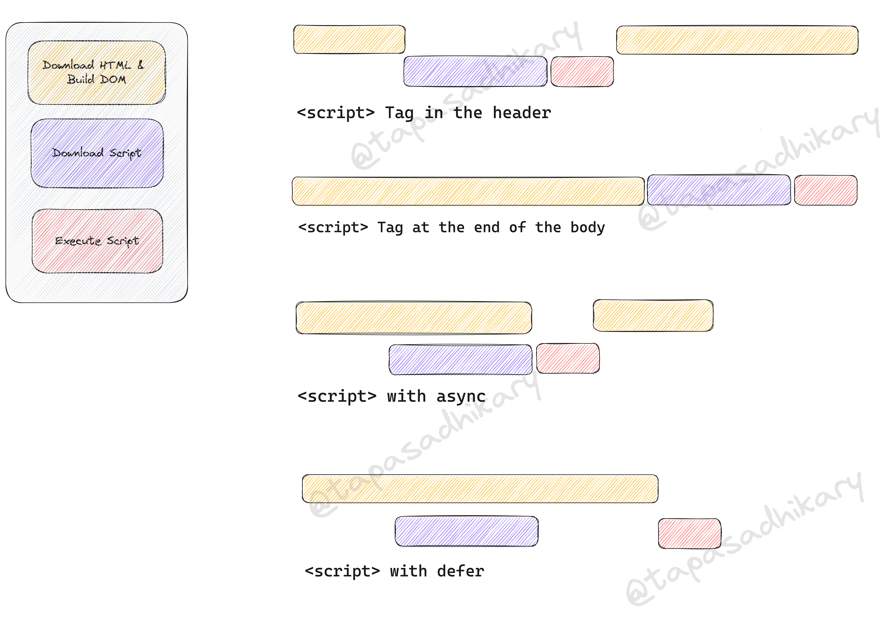

# The best way to load a JavaScript file in HTML - HTML async vs defer

The project files:

- `secret-santa-1`: Demonstrates the script in the header.
- `secret-santa-2`: Demonstrates the script at the end of the body.
- `secret-santa-3`: Demonstrates the script in the header with the `async` attribute.
- `secret-santa-4`: Demonstrates the script in the header with the `defer` attribute.

## Learn with an Interactive Video Tutorial

https://www.youtube.com/watch?v=4sBfx3ISBdM

## Script Loading with Infographics

  

  
